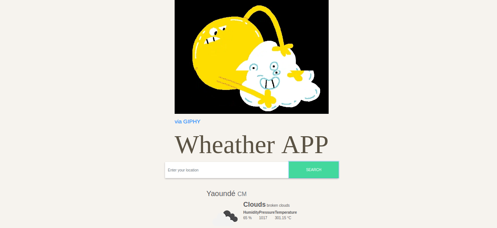

# Weather Forecast APP

> Search for a specific location and toggle displaying the data in Fahrenheit or Celsius

The look of the page change based on the data fetched through the weather API, maybe by changing the color of the background or by adding images that describe the weather.

A full description of the project can be found [here](https://www.theodinproject.com/courses/javascript/lessons/weather-app)

## Built With

- HTML5
- CSS3
- Javascript
- Webpack

## Getting Started

To get a local copy up and running follow these simple example steps.

### Prerequisites

- Node.js
- 

### Setup

### Install

### Usage

### Run tests

### Deployment

## Authors

👤 **Mael FOSSO**

- [Mael FOSSO](https://github.com/maelfosso)

- GitHub: [@maelfosso](https://github.com/maelfosso)
- Twitter: [@maelfosso](https://twitter.com/maelfosso)
- LinkedIn: [LinkedIn](https://www.linkedin.com/in/mael-fosso-650b6346/)

## 🤝 Contributing

Contributions, issues, and feature requests are welcome!

Feel free to check the [issues page](issues/).

## Show your support

Give a ⭐️ if you like this project!

## Acknowledgments

- Hat tip to anyone whose code was used
- Inspiration
- etc

## 📝 License

This project is [MIT](lic.url) licensed.

# WEATHER APP

This is the 5th project of the Main Javascript curriculum at [Microverse](https://www.microverse.org/) - @microverseinc

* The objective is to build a page with interactivity using everything learn about api
* The project was completed using Javascript language.

#### [Assignment link](https://www.theodinproject.com/courses/javascript/lessons/weather-app)

Project description can be found [here](https://www.theodinproject.com/courses/javascript/lessons/weather-app)

## Authors

- [Mael FOSSO](https://github.com/maelfosso)

